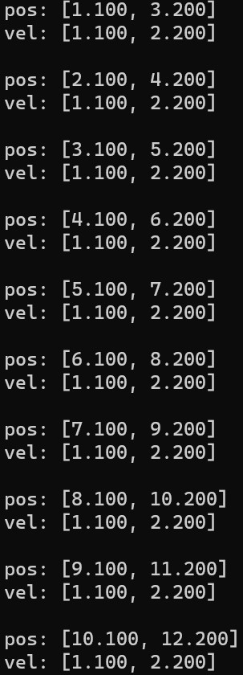
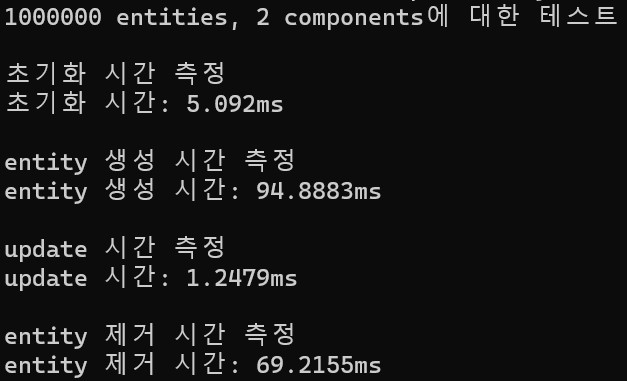

# SAFE99 (Small And Fast Engine C99)

## ECS(Entity Component System) 지원

### ECS란?

- Entity는 고유한 id를 가집니다.

- Component는 속성을 가집니다.

- System은 entity가 가지고 있는 component를 조작합니다.

이 세 가지가 따로 존재하기 때문에 데이터를 한 곳에 묶어서 캐시 적중률을 높일 수 있게 됩니다.

ECS를 구현함에 있어서 보통 SparseSet 방식과 Archetype 방식을 사용합니다. (safe99에선 Archetype 채택)

더 자세한 내용은 SanderMertens의 [ECS FAQ](https://github.com/SanderMertens/ecs-faq) 참고

### safe99 ECS 특징

1. Entity, Component, System 각각 최대 16,777,216개의 id를 가질 수 있습니다.

1. Entity는 최대 65,536 세대를 가질 수 있습니다.

1. view를 이용하여 쉽고 간편한 iteration이 가능합니다.

### ECS 예제 코드
``` c
#include <stdio.h>

#include "ecs.h"

typedef struct
{
    float x;
    float y;
} position_t, velocity_t;

ecs_id_t g_pos;
ecs_id_t g_vel;

void update_pos(const ecs_view_t* p_view)
{
    for (size_t i = 0; i < p_view->num_archetypes; ++i)
    {
        const archetype_t* p_archetype = &p_view->p_archetypes[i];

        position_t* p_pos = (position_t*)ecs_get_instances_or_null(p_view, i, g_pos);
        velocity_t* p_vel = (velocity_t*)ecs_get_instances_or_null(p_view, i, g_vel);

        for (size_t j = 0; j < p_archetype->num_instances; ++j)
        {
            p_pos[j].x += p_vel[j].x;
            p_pos[j].y += p_vel[j].y;

            printf("pos: [%.3f, %.3f]\n", p_pos[j].x, p_pos[j].y);
            printf("vel: [%.3f, %.3f]\n\n", p_vel[j].x, p_vel[j].y);
        }
    }
}

int main(void)
{
    ecs_world_t world;
    ecs_init(&world, 10, 2, 2);

    g_pos = ECS_REGISTER_COMPONENT(&world, position_t);
    g_vel = ECS_REGISTER_COMPONENT(&world, velocity_t);

    const ecs_id_t update_pos_system = ECS_REGISTER_SYSTEM(&world, update_pos, 2, g_pos, g_vel);

    for (size_t i = 0; i < 10; ++i)
    {
        const ecs_id_t entity = ecs_create_entity(&world);
        ecs_set_component(&world, entity, g_pos, &(position_t){ (float)i, (float)i + 1.0f });
        ecs_set_component(&world, entity, g_vel, &(velocity_t){ 1.1f, 2.2f });
    }

    ecs_update_system(&world, update_pos_system);

    return 0;
}
```

실행 결과



### 성능 측정
1,000,000개의 entity를 생성하고 2개의 copmponent 추가 시 걸리는 시간 측정



## TODO
 1. D3D 11 지원

 1. ECS에서 각 System에 타이머 설정 기능

## 요구사항
최소 프로세서: x86/x64 SSE3 지원 프로세서 (현시점 SSE3 지원하지 않는 프로세서도 가능)

지원 OS: x86/x64 Windows

미지원 OS: Unix/Linux 계열

IDE: Visual Studio 2019 커뮤니티 이상

## 빌드 방법
1. build_dll.bat 실행

    - output/dll 폴더에 각 dll 프로젝트의 .dll 생성됨

    - output/lib 폴더에 각 dll 프로젝트의 .lib 생성됨

    - ouput/pdb 폴더에 각 dll 프로젝트의 .pdb 생성됨

* 실행이 되지 않는다면 build_dll.bat 메모장으로 열어서 MSBuild 경로 수정

## 내 프로젝트에서 사용하는 방법
1. output/dll, output/lib에 있는 .dll, .lib 내 프로젝트에 추가

1. 프로젝트에 .dll, .lib 연결 후 사용